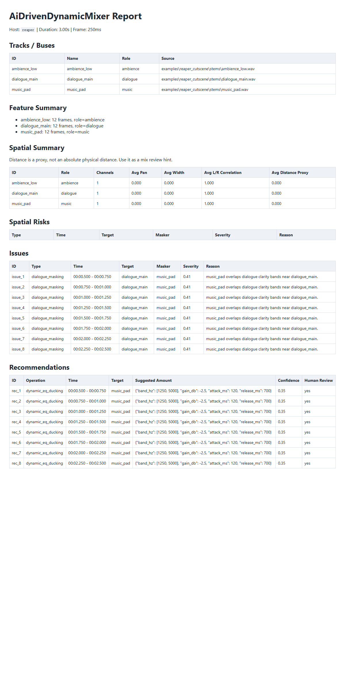

# AiDrivenDynamicMixer

Cross-host mix diagnostics: analyse offline stems or runtime telemetry, locate **dialogue masking** and **spatial conflicts**, and produce a reviewable JSON/HTML report — without ever modifying the session.



## Why I Built This

Mixing for intelligibility is the part of the job that is hardest to do by ear at speed. Dialogue can be buried by a music bed or an ambience, gunfire can smear the clarity band of a line, and a stereo pad can collapse the centre image — and all of it is easy to miss when listening to one pass instead of the 40 seconds where it matters.

The tools that help are either metering (which shows level, not conflict) or fully automatic mixing (which makes artistic decisions on the mixer's behalf). I wanted the middle ground: **evidence, with precise time ranges, in a form a human can check and act on**.

Two constraints follow from that, and they define the project:

1. **The tool must not touch the project.** No automation, no RTPC writes, no snapshots, no session changes. It emits recommendations; a human decides.
2. **Analysis must be explainable.** Every finding has to be traceable to a numeric criterion, so a mixer can verify the call instead of trusting a model.

## What It Does

- **Two input paths, one analysis core:** offline REAPER stems (WAV) or Wwise-style runtime telemetry (JSON).
- **Parameterised feature extraction:** an 8-band energy timeline plus loudness, L/R correlation and stereo width, per track, per frame.
- **Dialogue-masking detection** in the speech-clarity bands, with a severity score and frame-accurate time ranges.
- **Spatial-conflict detection** from correlation, width and level — including dialogue that is too wide for a centre image.
- **Recommendations with review flags:** each issue maps to a concrete operation (e.g. band-limited ducking with gain/attack/release) marked `requires_human_review`, plus a per-host mapping hint.
- **Reviewable output:** `session.json`, `features.json`, `issues.json`, `recommendations.json`, plus an HTML report, a per-second action list and a spatial summary.

## Workflow

```text
Stems (WAV)  /  Wwise telemetry (JSON)
        |
        v
Feature extraction       8 bands + loudness + L/R correlation + stereo width, per frame
        |
        v
Detection                dialogue masking  |  spatial conflict
        |
        v
Explainable report       issues with severity, evidence, and exact time ranges
        |
        v
Recommendations          concrete operations, requires_human_review = true
        |
        v
Human review -> applied by hand in REAPER / Wwise
```

## Technical Highlights

- **A parameterised feature layer, deliberately not raw audio.** Nothing sends samples or full STFT matrices anywhere. Features are computed once, are reproducible, and are what the report is written from. This keeps the analysis auditable and cheap — and it is the reason a model can be introduced later without changing the contract.
- **Eight fixed bands**, spanning 40 Hz to 10 kHz (`40-80`, `80-160`, `160-320`, `320-640`, `640-1250`, `1.25k-2.5k`, `2.5k-5k`, `5k-10k`).
- **Speech-clarity bands chosen explicitly.** Masking is evaluated in `1.25k-2.5k` and `2.5k-5k`, the region that carries consonant intelligibility — not across the whole spectrum.
- **Thresholds you can read off the source.** Dialogue masking: the masker's clarity-band average within 3 dB of the dialogue's, while dialogue loudness exceeds −60 dBFS. Severity: `clamp((Δ + 6) / 18, 0.1, 1.0)`. Spatial conflict: L/R correlation below −0.2, stereo width above 0.4, loudness above −55 dBFS.
- **A third spatial check beyond the textbook one.** Dialogue that is wider than a centre image should be is flagged separately — phase/widening problems on a dialogue stem degrade intelligibility even when correlation alone looks acceptable.
- **Frame-accurate, not track-level.** Findings carry `time_start` / `time_end`, because "the music is too loud" is not actionable and "music masks dialogue at 00:00:00.500–00:00:00.750" is.
- **Human-in-the-loop is enforced in the data model.** Every recommendation carries `requires_human_review: true`, and every host mapping hint is phrased as "map this … **after human approval**".
- **Standard library by default.** WAV reading uses the standard library; narrow-band analysis uses the Goertzel algorithm, with numpy as an optional accelerator rather than a requirement.

## Demo

The included demo was produced by the tool itself, from the repository's **synthetic example stems** (a dialogue line, a music pad and a low ambience), so it can be inspected without any production material:

| Artifact | What it shows |
|---|---|
| `demo/report.html` | The HTML report: per-track features and the detected issues |
| `demo/issues.json` | Detected issues with severity, evidence and exact time ranges |
| `demo/recommendations.json` | Recommended operations with review flags and host mapping hints |
| `demo/session.json` | The analysed session (tracks, roles, frame geometry) |
| `demo/spatial_summary.json` | The spatial-conflict summary |
| `examples/telemetry-example.json` | The Wwise-style telemetry input format |

A worked example from the demo: `music_pad` overlaps `dialogue_main` in the clarity bands at 00:00:00.500–00:00:00.750 (severity ≈ 0.41), producing a recommendation for band-limited ducking of 1250–5000 Hz at −2.5 dB with a 120 ms attack and 700 ms release — flagged for human review.

## Architecture

```text
core/
  audio_features/   band energy, loudness, correlation, width  (Goertzel / optional numpy)
  masking/          dialogue-masking and spatial-conflict criteria
  spatial_features/ spatial analysis
  ai_reasoning/     deterministic rule engine -> recommendations
  reports/          HTML, per-second and spatial report modules
  schemas/          the data contract (session, issue, recommendation)
adapters/
  reaper/           stem export helpers (Lua) — never modifies the session
  wwise/            project reader and telemetry importer
apps/               CLI entry points
```

`docs/method.md` documents the detection criteria; `docs/report-schema.md` documents the JSON contract.

## My Role

Sole author: analysis design, feature extraction, detection criteria, the rule engine, report generation, the REAPER/Wwise adapters and the CLI.

## Limitations

These are deliberate boundaries, not a roadmap:

- **v1 is a deterministic rule engine.** There is no LLM in the inference path. The schema reserves an adapter slot for one, but nothing in this repository calls a model, and the reports are generated by fixed rules — reproducible by construction.
- **The tool does not modify anything.** It produces reports and recommendations. Writing automation, RTPCs or snapshots is explicitly out of scope, and the adapters are built to be read-only.
- **Recommendations are starting points, not answers.** Confidence values are low by design (the bundled example scores ≈ 0.35), and `requires_human_review` is always true. Mixing is an aesthetic decision.
- **Loudness is an approximation**, not an ITU-R BS.1770 measurement, and band energy is per-frame, not perceptually weighted.
- **Thresholds are heuristics** tuned on example material; they are documented in the source precisely so they can be argued with.
- **Track labels are derived heuristically.** The per-second report derives short labels from track ids (stripping a numeric index prefix, honouring a `_vo_` convention) and matches remediation rules on label keywords, so unusual naming conventions may produce less specific advice than a hand-tuned mapping would.
- **Synthetic fixtures only.** The bundled example is generated test material; the tool has not been validated against a large set of real sessions.

## Repository Scope

This is a portfolio showcase repository. The full development repository remains private.

Included: the masking/rule-engine/report core, the CLI-visible data contract, the example telemetry input, and demo output generated from synthetic stems. Excluded: session analysis output from real projects, the REAPER/Wwise adapter implementations, and production audio.

## Tech Stack

`Python 3.11+` · standard-library WAV I/O · `Goertzel` narrow-band analysis · band-energy / loudness / L-R correlation / stereo width · deterministic rule engine + JSON Schema · `REAPER Lua` adapter · `Wwise` telemetry adapter · HTML report generation · `pytest`